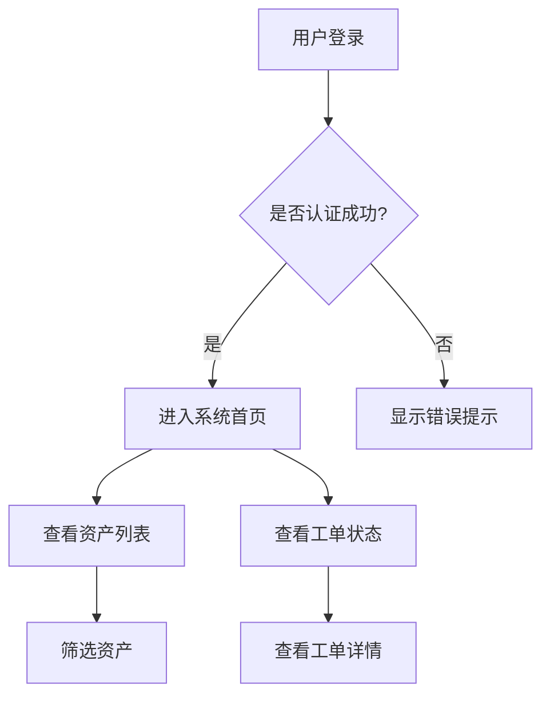

# 产品需求文档 (PRD) Skill

当你需要撰写 PRD 时，必须严格遵循以下结构和格式，并按照项目/版本规范归档。

## 强制规则（必须遵守）
- **必须**：严格按照下方定义的结构和顺序输出，不得自行增减章节或修改标题层级。
- **必须**：开始撰写前先读取 `.ai-workflow/PLATFORM_REQUIREMENT_CONFIG.md`，并明确写出 `platform_id`（`asset-management` 或 `oam-collaboration`）。
- **必须**：PRD 内容需覆盖 `platform_id` 对应平台的主流功能域、典型流程与硬性项；超出平台边界的内容必须标记“超边界项”。
- **必须**：所有 `{{占位符}}` 必须替换为实际内容；若某信息缺失，用“待补充”明确标记，不得留空。
- **必须**：表格必须使用 Markdown 表格语法，对齐方式使用 `:---`。
- **必须**：流程图必须使用 Mermaid 语法，放在代码块中，并确保可渲染。
- **必须**：文件名必须包含项目标识（英文）、版本号和日期，格式为 `PRD_{{YYYYMMDD}}.md`（建议可选包含平台标识）。
- **必须**：PRD 中描述的所有界面元素和交互行为，必须遵循项目通用设计规范（详见 `docs/通用设计规范.md`），除非在文档中明确说明存在特殊规则。
- **必须**：在功能详情中，根据平台标识引入行业特定章节（如结算规则、工单状态机）。
- **禁止**：在 PRD 中添加本模板未定义的章节（如“致谢”、“参考文献”等）。
- **禁止**：使用除 `#`、`##`、`###` 以外的标题层级。

---

## 文档基础信息表

| 项目 | 内容 |
| :--- | :--- |
| **产品版本** | {{版本号}} |
| **创建日期** | {{当前日期}} |
| **产品经理** | {{PM姓名}} |
| **所属项目** | {{项目名（中文）}} |
| **平台标识** | {{platform_id: asset-management/oam-collaboration}} |
| **涉及平台** | {{涉及平台，如：资管平台、小原有助}} |
| **需求类型** | {{新增功能/功能优化}} |
| **UI设计稿** | {{设计稿链接地址，若无则填“待补充”}} |

## 1. 文档概述

### 1.1. 需求背景
- **需求来源**：说明需求从哪里来，要解决什么问题。
- **用户角色与场景**：Who、When & Where、What。
- **商业价值**：Why。

### 1.2. 目标用户
列出该版本功能面向的具体用户群体，可细化电力行业角色：如资产方运营人员、运维方调度员、财务结算专员。

### 1.3. 版本目标
- **目标效果**：需要达成的目标。
- **范围边界**：做什么、不做什么。

### 1.4. 名词解释
用表格形式解释新名词，强制引入电力行业术语，例如：

| 名词 | 解释说明 |
| :--- | :--- |
| 光伏逆变器 | 将光伏组件产生的直流电转换为交流电的设备 |
| PCS | 储能变流器，控制电池充放电的装置 |
| SOC | 电池荷电状态，反映剩余电量百分比 |
| 需量电费 | 按用户在某时段内的最大需量计算的基本电费 |
| 工单状态机 | 工单在不同阶段的状态流转规则 |

## 2. 功能需求

### 2.1. 产品流程图
使用 Mermaid 语法绘制核心流程图，展示用户操作与系统响应的主要流程。示例：




### 2.2. 功能列表
| 所属平台 | 功能模块 | 主要功能描述 |
| :--- | :--- | :--- |
| {{平台1}} | {{模块1}} | {{简短描述}} |
| {{平台2}} | {{模块2}} | {{简短描述}} |

### 2.3. 功能详情

每个功能点需按以下结构展开描述：

#### 功能名称：{{功能名称}}
**用户故事**：作为一名{{用户角色}}，我想要{{完成某任务}}，以便于{{达成某目标}}。

**界面元素说明**（根据功能实际情况选择适用的区域描述）：

- **查询区域**（如果包含筛选功能）：
  - 列出所有查询条件字段，每个字段需说明：
    - 字段名称
    - 控件类型（文本框、下拉单选、下拉多选、日期范围选择器等）
    - 数据来源（如枚举值、来自哪个配置表、动态过滤规则）
    - 默认值（如有）
    - 联动规则（如选择项目公司后，项目负责人下拉选项过滤）
  - **查询按钮**：点击后刷新列表数据，说明是否带加载状态。
  - **重置按钮**：清空所有查询条件，恢复默认值并刷新列表。

- **列表区域**（如果包含数据列表）：
  - **展示字段**：列出字段名称、顺序、是否支持排序、是否支持自定义列。
  - **分页规则**：每页默认条数、可切换的条数选项、分页组件样式。
  - **行内操作**：每行数据包含的操作按钮（如查看详情、编辑、删除），并说明点击后的行为（跳转页面、弹出抽屉/弹窗等）。
  - **空状态**：列表无数据时展示的提示文案或占位图。
  - **特殊状态**：如加载中、错误重试等（可选）。

- **功能按钮区域**（列表上方或详情页内的主要操作）：
  - 按钮名称、位置（如列表上方、详情页内、行内）。
  - 触发动作（新增、编辑、删除、导出、提交等）。
  - 权限控制：哪些角色可见/可用（如有）。
  - 二次确认：对于删除、停用等危险操作，是否需要弹窗确认。
  - 交互细节：如点击后是打开新页面、弹窗、抽屉，还是刷新列表。

- **表单/详情页区域**（如果包含新增/编辑/查看详情）：
  - **字段列表**：每个字段需说明：
    - 字段名称
    - 是否必填
    - 控件类型（文本框、下拉框、日期选择器、多选框等）
    - 数据来源/选项（静态枚举或动态接口）
    - 默认值
    - 校验规则（如格式、唯一性、依赖关系）
    - 是否只读（如系统自动生成字段）
  - **布局说明**：字段分组（如基础信息、开发信息、运维信息），分步/分页式表单需说明步骤顺序和提交逻辑。
  - **按钮**：
    - **取消**：关闭表单，不保存数据。
    - **保存/提交**：触发校验，通过后提交数据，成功后行为（关闭表单、刷新列表、跳转下一步）。
    - **其他操作**：如“保存并继续”、“暂存”等。

**详细描述**（补充上述结构未覆盖的内容）：
- **前置条件**：用户需满足的权限或系统状态。
- **交互流程**：按步骤描述用户操作后的系统反馈（可结合流程图）。
- **业务规则**：核心逻辑、计算公式、约束条件。
- **异常处理**：网络错误、校验失败、后端报错等情况的处理方式。

## 3. 非功能性需求
| 需求类型 | 要求 |
| :--- | :--- |
| 性能要求 | {{性能要求}} |
| 安全性要求 | {{安全性要求}} |
| 兼容性要求 | {{兼容性要求}} |
| 埋点要求 | {{埋点要求}} |

## 4. 后续迭代方向
- {{方向1}}
- {{方向2}}
- {{方向3}}

---


---

### `market-research` SKILL.md

```markdown
---
name: market-research
description: 竞品分析报告撰写规范（增强电力行业对比维度）
---

# 竞品分析报告 Skill

## 强制规则（必须遵守）
- **必须**：开始前先读取 `.ai-workflow/PLATFORM_REQUIREMENT_CONFIG.md`，确认 `platform_id`（`asset-management` 或 `oam-collaboration`）。
- **必须**：竞品选择与对比维度需贴合 `platform_id` 对应主流功能域。
- **必须**：若发现超出平台边界的结论，必须单列“超边界项”，不得混入主结论。
- **必须**：至少分析 3 个竞品，最多 5 个竞品。优先选择电力行业头部企业（如国网综能、南网能源、特来电、远景能源等）。
- **必须**：所有结论需标明证据来源（官网页面、产品截图、公开文档或用户反馈）。
- **必须**：附上竞品界面截图，并用箭头标注关键差异点。

## 文档结构
1. **基础信息**
   - 项目名称、项目标识、版本号
   - `platform_id`
   - 研究日期
   - 范围边界（In Scope / Out of Scope）

2. **分析目标**
   - 本次分析要回答的关键问题

3. **竞品列表与选择理由**
   - 3-5 个竞品
   - 每个竞品的选择原因（市场地位/功能相关性/目标客群重合度）

4. **对比维度**
   - 功能、用户体验、商业模式、技术实现
   - 平台聚焦维度：
     - `asset-management`：资产接入方式（直采/规约转换）、监控指标丰富度、结算灵活度、报表导出格式
     - `oam-collaboration`：工单派发模式（抢单/指派）、备件库存管理、移动端能力、验收流程

5. **核心发现**
   - 每个竞品的亮点与不足
   - 证据引用（页面路径、截图编号、来源链接）

6. **差异化机会**
   - 我们的产品如何与众不同（限定在平台边界内），结合虚拟电厂运营商的实际痛点（如结算复杂、工单响应慢）提出创新点

7. **功能借鉴建议**
   - 可借鉴的具体功能点
   - 建议优先级（P0/P1/P2）

8. **边界说明**
   - 本报告是否存在“超边界项”
   - 超边界项处理建议（纳入后续专题或明确排除）

## 输出格式
- 用表格对比核心功能。
- 附上竞品截图（使用 Playwright 截图后嵌入或提供路径）。
- 输出文件命名：`竞品分析_{{YYYYMMDD}}.md`。
- 输出目录：`docs/{{平台标识}}/research/{{项目名}}/{{版本号}}/`。


## 产品需求文档（PRD）生成注意事项（不写入模板，V2 以本节为准）
- 目录结构：目录层级不超过三级；在线文档需开启自动目录。
- 需求背景：必须明确来源、用户痛点与商业价值，优先附数据或用户原话证据。
- 用户故事公式：统一使用“作为一名<角色>，我想要<动作>，以便于<收益>”。
- 功能描述无歧义：优先使用“当……时，系统……”句式，覆盖正常流程、异常流程与边界条件。
- 原型与配图必备：关键功能必须配原型/示意图，图上标注交互行为与状态变化，并添加图注。
- 非功能量化：非功能性需求必须可量化（如“接口响应 <200ms”），禁止“性能要好”等模糊表达。
- 边界条件完整：必须覆盖输入校验、权限校验、状态流转。
- 异常处理友好：提示文案需同时说明“为什么 + 怎么办”。
- 埋点同步：数据埋点需同步定义，明确指标含义与采集方式。
- 多角色可读：PRD需兼顾设计、开发、测试、运营视角，避免单角色语言。
- 评审前预检：提交评审前需自测并建议同事预审。
- 评审方式：评审时聚焦不确定项与争议点，避免逐字念文档。
- 评审后更新：评审后需及时更新文档并高亮修改处通知参会人员。
- 版本规范：版本号采用“主版本.次版本.修订号”；重大变更升级主版本。
- 修改留痕：必须维护修订历史（版本、日期、修改内容、修改人）。
- 持续维护：开发过程变更需同步更新，上线后补充复盘。
- 提交前清单：提交前按检查清单自测，确认背景、目标、范围、规则、埋点等覆盖完整。
- 覆盖规则：如与旧版 PRD 生成注意事项冲突，以本节（V2）为准。
- 本节仅约束“生成PRD文档”的表达方式，不得直接写入模板正文。
