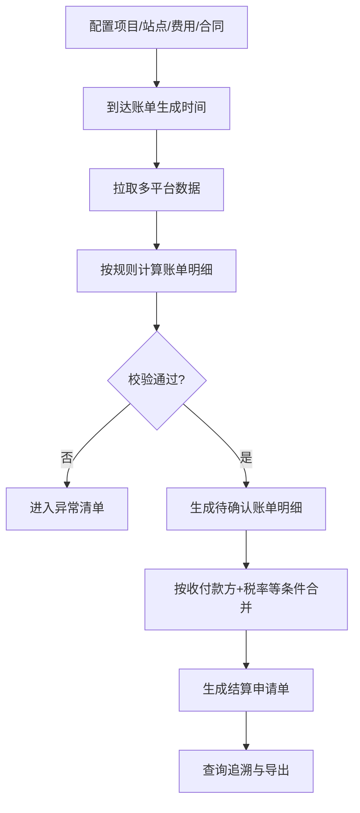

# PRD_settlement_V2.2.1_20260226_v2

## 📋 文档基础信息表

| 项目 | 内容 |
| :--- | :--- |
| **产品版本** | V2.2.1 |
| **创建日期** | 2026-02-26 |
| **产品经理** | 待补充 |
| **所属项目** | DAO OS 2.0 - 结算 |
| **涉及平台** | 运营管理后台、资管平台、太极交易平台 |
| **需求类型** | 新增功能 |
| **UI设计稿** | 待补充 |

## 1. 文档概述

### 1.1. 需求背景
- **需求来源**：储能运营商当前主要依赖人工从第三方系统导出账单或手工计算，导致效率低、差错高、追溯难。
- **用户角色与场景**：
  - Who：结算专员、运营人员、财务复核人员。
  - When & Where：每个结算周期（月/季）在运营管理后台进行出账与核对。
  - What：按项目绑定站点、配置费用和合同，按站点自动生成账单明细并合并结算申请单。
- **商业价值**：减少人工成本、提升结算准确率、缩短结算周期，并为后续多资产扩展提供统一底座。

### 1.2. 目标用户
1. 储能运营商结算人员。
2. 储能运营管理人员。
3. 财务复核人员。

### 1.3. 版本目标
- **目标效果**：
  1. 自动生成四类费用账单明细。
  2. 支持按收付款方、税率一致合并生成结算申请单。
  3. 实现规则与参数配置化并可追溯。
- **范围边界**：
  - 本期做：项目/站点/费用/合同关联、自动出账、申请单合并、账单追溯。
  - 本期不做：审批流、开票对接、应收应付台账。

### 1.4. 名词解释

| 名词 | 解释 |
| :--- | :--- |
| 结算周期 | 账单计算时间范围，如月结、季结 |
| 账单明细 | 某站点在某账期某费用项的计算结果 |
| 结算申请单 | 满足合并条件的一组账单明细形成的结算单据 |
| 分时电价 | 按峰平谷时段定义的电价 |
| 需量电费增额 | 需量差值与需量电价计算得到的增额费用 |
| 逆流容差额 | 储能上网场景下按计量电价与光伏上网电价计算的差额 |

## 2. 功能需求

### 2.1. 产品流程图

### 2.2. 功能列表
| 所属平台 | 功能模块 | 主要功能描述 |
| :--- | :--- | :--- |
| 运营管理后台 | 关联配置 | 项目绑定站点、站点绑定费用与合同 |
| 运营管理后台 | 规则配置中心 | 配置费用、结算周期、公式参数、收付款方、税率、分成比例、生效时间 |
| 运营管理后台 | 自动出账任务 | 按生成时间触发批任务并生成账单明细 |
| 运营管理后台 | 申请单合并 | 按收付款方/税率/币种/期间一致规则合并 |
| 运营管理后台 | 账单追溯 | 展示公式快照、参数快照、来源快照 |
| 资管平台 | 主数据接口 | 提供合同、资产、合作方主数据 |
| 太极交易平台 | 需求响应接口 | 提供削峰/填谷认定金额 |

### 2.3. 功能详情

#### 功能点A：项目-站点-费用-合同关联
- **用户故事**：作为一名结算专员，我想在项目下绑定站点并维护费用与合同关系，以便系统可按站点自动结算。
- **详细描述**：
  - 前置条件：项目、站点、合作方主数据已存在。
  - 交互流程：选择项目 -> 绑定站点 -> 选择费用类型 -> 绑定对应合同 -> 保存生效时间。
  - 业务规则：站点可绑定多个费用项；同费用项同生效区间不可重复生效。
  - 异常处理：生效区间重叠时阻断保存并提示冲突。

#### 功能点B：费用规则配置中心
- **用户故事**：作为一名运营人员，我想通过配置规则定义不同费用计算方式，以便无需开发改代码即可调整结算。
- **详细描述**：
  - 前置条件：已有费用项。
  - 交互流程：选择费用项 -> 选择计费模板 -> 填写参数（税率、分成比例、电价来源等）-> 配置账单生成时间。
  - 业务规则：分成比例范围 0~100%；税率取值按税务字典；规则按优先级生效（站点 > 项目 > 全局）。
  - 异常处理：参数缺失或非法则规则不可发布。

#### 功能点C：自动生成账单明细
- **用户故事**：作为一名结算专员，我想系统自动按账期生成账单明细，以便减少人工计算。
- **详细描述**：
  - 前置条件：规则已生效，数据源可用。
  - 交互流程：到达任务触发时间 -> 系统拉取数据 -> 逐站点逐费用项计算 -> 生成草稿明细。
  - 业务规则：
    - 租赁费：支持按设备或按站点月租。
    - 节能分成收益：（峰谷套利收益 - 需量电费增额）* 节能方分成比例。
    - 逆流容差额：储能上网电量 * （计量电价*付款方分成比例 - 光伏上网电价）；若无光伏上网电价则不减。
    - 需求响应收益：削峰或填谷认定金额 * 收款方分成比例。
  - 异常处理：缺数、负值异常、合同失效、税率冲突时标记异常并不进入可合并状态。

#### 功能点D：结算申请单合并
- **用户故事**：作为一名结算专员，我想系统自动将可合并明细聚合为申请单，以便快速发起结算。
- **详细描述**：
  - 前置条件：账单明细状态为待确认。
  - 交互流程：系统按合并条件分组 -> 生成申请单头与明细列表。
  - 业务规则：仅在收款方、付款方、税率、币种、期间一致时合并。
  - 异常处理：条件不一致则拆单。

#### 功能点E：账单追溯与导出
- **用户故事**：作为一名财务复核人员，我想查看每条账单计算依据并导出，以便复核和留档。
- **详细描述**：
  - 前置条件：账单明细已生成。
  - 交互流程：查询明细 -> 打开详情 -> 查看公式/参数/来源 -> 导出报表。
  - 业务规则：每条明细必须记录公式版本、参数快照、来源系统与来源记录ID。
  - 异常处理：来源记录缺失时提示“数据追溯不完整”。

## 3. 非功能性需求
| 需求类型 | 要求 |
| :--- | :--- |
| 性能要求 | 支持 100 站点月结批次在 15 分钟内完成；支持失败任务重试 3 次 |
| 安全性要求 | 金额与合同字段按角色授权；关键操作写审计日志 |
| 兼容性要求 | 兼容主流 Chromium 内核浏览器；接口支持多系统数据标准化 |
| 埋点要求 | 记录规则发布、出账任务、异常处理、重算触发、导出操作 |

## 4. 后续迭代方向
- 引入异常中心与局部重算引擎。
- 扩展光伏、充电桩、售电、能源站费用模型。
- 增强对账看板与争议处理闭环。
