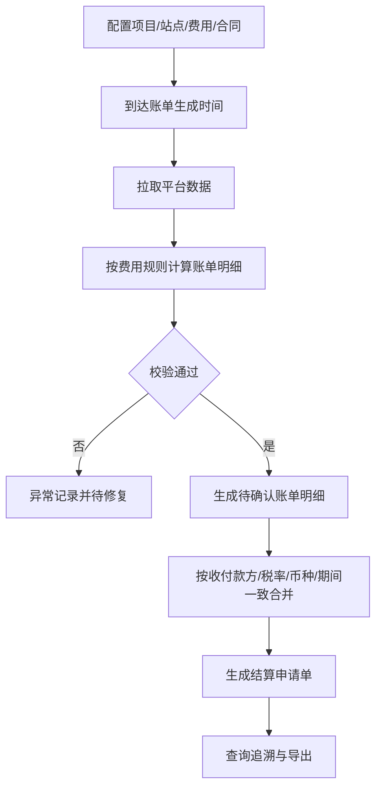

# PRD_settlement_V2.2.1_20260226_v3

## 📋 文档基础信息表

| 项目 | 内容 |
| :--- | :--- |
| **产品版本** | V2.2.1 |
| **创建日期** | 2026-02-26 |
| **产品经理** | 待补充 |
| **所属项目** | DAO OS 2.0 - 结算 |
| **涉及平台** | 运营管理后台、资管平台、太极交易平台 |
| **需求类型** | 新增功能 |
| **UI设计稿** | 待补充 |

## 1. 文档概述

### 1.1. 需求背景
- **需求来源**：储能运营商当前主要依赖人工从第三方系统导出账单或手工计算，现需自动化生成账单。
- **用户角色与场景**：
  - Who：结算专员、运营人员、财务复核人员。
  - When & Where：按月或按季结算周期，在运营管理后台发起结算生成。
  - What：按项目绑定电站、配置费用、维护合同，按电站生成账单明细并合并形成结算申请单。
- **商业价值**：提升结算效率和准确率，降低人工风险，形成可扩展的多资产结算底座。

### 1.2. 目标用户
1. 储能运营商结算专员。
2. 储能运营管理人员。
3. 财务复核人员。

### 1.3. 版本目标
- **目标效果**：
  1. 自动生成结算周期账单明细。
  2. 支持账单明细按收付款方与税率一致自动合并为结算申请单。
  3. 支持费用、结算周期、费用规则、收付款方、分成比例、账单生成时间全配置。
  4. 支持后续扩展光伏、充电桩、售电、能源站。
- **范围边界**：
  - 做：关联建模、规则配置、自动出账、合并申请单、追溯。
  - 不做：结算审批流、开票对接、应收应付台账。

### 1.4. 名词解释

| 名词 | 解释说明 |
| :--- | :--- |
| 结算周期 | 账单计算的时间范围，如月结、季结 |
| 账单明细 | 某站点在某账期某费用项的计算结果记录 |
| 结算申请单 | 符合合并规则的一组账单明细聚合形成的结算单据 |
| 峰谷套利收益 | 各时段放电收益减去各时段充电成本 |
| 需量电费增额 | 需量差值乘以需量电价得到的费用增额 |
| 逆流容差额 | 储能上网电量结合计量电价与光伏上网电价计算的差额 |

## 2. 功能需求

### 2.1. 产品流程图

### 2.2. 功能列表
| 所属平台 | 功能模块 | 主要功能描述 |
| :--- | :--- | :--- |
| 运营管理后台 | 项目关联配置 | 按项目绑定站点，按站点绑定费用与合同 |
| 运营管理后台 | 结算配置中心 | 维护费用、周期、规则、收付款方、税率、分成比例、生成时间 |
| 运营管理后台 | 自动出账 | 按结算周期批量生成账单明细 |
| 运营管理后台 | 申请单合并 | 满足条件的账单明细自动合并生成结算申请单 |
| 运营管理后台 | 账单追溯 | 查看公式、参数、来源数据快照 |
| 资管平台 | 合同与资产主数据 | 提供合同、资产、合作方基础数据 |
| 太极交易平台 | 需求响应数据 | 提供削峰/填谷认定金额数据 |

### 2.3. 功能详情
#### 功能A：项目-站点-费用-合同关联
- **用户故事**：作为一名结算专员，我想按项目绑定站点并配置费用与合同，以便系统自动按站点结算。
- **详细描述**：
  - 前置条件：项目、站点、合同主数据可用。
  - 交互流程：选择项目 -> 绑定站点 -> 选择费用项 -> 绑定合同 -> 保存。
  - 业务规则：同站点同费用项同生效区间不可重复配置。
  - 异常处理：配置冲突时报错并阻断保存。

#### 功能B：规则配置中心
- **用户故事**：作为一名运营人员，我想配置不同费用规则与参数，以便不改代码即可适配业务变化。

- **详细描述**：
  - 前置条件：费用模板已启用。
  - 交互流程：选择费用类型 -> 配置公式参数与来源 -> 设置收付款方、税率、分成比例与生效时间。
  - 业务规则：支持规则优先级（站点 > 项目 > 全局）；参数合法性校验。
  - 异常处理：参数缺失、比例越界、税率非法时禁止发布。

### 2.3. 功能详情（通用标准化模板）

每个功能点需按以下结构展开描述：

#### 功能名称：{{功能名称}}
**用户故事**：作为一名{{用户角色}}，我想要{{完成某任务}}，以便于{{达成某目标}}。

**界面元素说明**（根据功能实际情况选择适用的区域描述）：

- **查询区域**（如果包含筛选功能）：
  - 列出所有查询条件字段，每个字段需说明：
    - 字段名称
    - 控件类型（文本框、下拉单选、下拉多选、日期范围选择器等）
    - 数据来源（如枚举值、来自哪个配置表、动态过滤规则）
    - 默认值（如有）
    - 联动规则（如选择项目公司后，项目负责人下拉选项过滤）
  - **查询按钮**：点击后刷新列表数据，说明是否带加载状态。
  - **重置按钮**：清空所有查询条件，恢复默认值并刷新列表。

- **列表区域**（如果包含数据列表）：
  - **展示字段**：列出字段名称、顺序、是否支持排序、是否支持自定义列。
  - **分页规则**：每页默认条数、可切换的条数选项、分页组件样式。
  - **行内操作**：每行数据包含的操作按钮（如查看详情、编辑、删除），并说明点击后的行为（跳转页面、弹出抽屉/弹窗等）。
  - **空状态**：列表无数据时展示的提示文案或占位图。
  - **特殊状态**：如加载中、错误重试等（可选）。

- **功能按钮区域**（列表上方或详情页内的主要操作）：
  - 按钮名称、位置（如列表上方、详情页内、行内）。
  - 触发动作（新增、编辑、删除、导出、提交等）。
  - 权限控制：哪些角色可见/可用（如有）。
  - 二次确认：对于删除、停用等危险操作，是否需要弹窗确认。
  - 交互细节：如点击后是打开新页面、弹窗、抽屉，还是刷新列表。

- **表单/详情页区域**（如果包含新增/编辑/查看详情）：
  - **字段列表**：每个字段需说明：
    - 字段名称
    - 是否必填
    - 控件类型（文本框、下拉框、日期选择器、多选框等）
    - 数据来源/选项（静态枚举或动态接口）
    - 默认值
    - 校验规则（如格式、唯一性、依赖关系）
    - 是否只读（如系统自动生成字段）
  - **布局说明**：字段分组（如基础信息、开发信息、运维信息），分步/分页式表单需说明步骤顺序和提交逻辑。
  - **按钮**：
    - **取消**：关闭表单，不保存数据。
    - **保存/提交**：触发校验，通过后提交数据，成功后行为（关闭表单、刷新列表、跳转下一步）。
    - **其他操作**：如“保存并继续”、“暂存”等。

**详细描述**（补充上述结构未覆盖的内容）：
- **前置条件**：用户需满足的权限或系统状态。
- **交互流程**：按步骤描述用户操作后的系统反馈（可结合流程图）。
- **业务规则**：核心逻辑、计算公式、约束条件。
- **异常处理**：网络错误、校验失败、后端报错等情况的处理方式。

#### 功能D：结算申请单合并
- **用户故事**：作为一名结算专员，我想自动合并符合条件的账单明细，以便快速结算。
- **详细描述**：
  - 前置条件：账单明细处于可合并状态。
  - 交互流程：系统分组 -> 生成申请单头与明细。
  - 业务规则：收款方、付款方、税率、币种、期间一致才可合并。
  - 异常处理：不满足条件自动拆分为不同申请单。

#### 功能E：账单追溯
- **用户故事**：作为一名财务复核人员，我想查看账单明细的计算依据，以便完成复核与审计。
- **详细描述**：
  - 前置条件：账单明细已生成。
  - 交互流程：查询明细 -> 查看详情 -> 导出。
  - 业务规则：每条明细记录公式快照、参数快照、来源系统与来源记录ID。
  - 异常处理：来源数据缺失时标记“追溯不完整”。

## 3. 非功能性需求
| 需求类型 | 要求 |
| :--- | :--- |
| 性能要求 | 100站点月结批处理在15分钟内完成；任务失败自动重试3次 |
| 安全性要求 | 关键金额字段按角色权限控制；操作日志全量留痕 |
| 兼容性要求 | 支持主流Chromium内核浏览器；跨平台接口字段标准化 |
| 埋点要求 | 记录规则发布、任务触发、异常处理、重算触发、导出行为 |

## 4. 后续迭代方向
- 扩展光伏、充电桩、售电、能源站费用模型。
- 建设异常中心与局部重算引擎。
- 建设结算对账看板与争议处理闭环。
