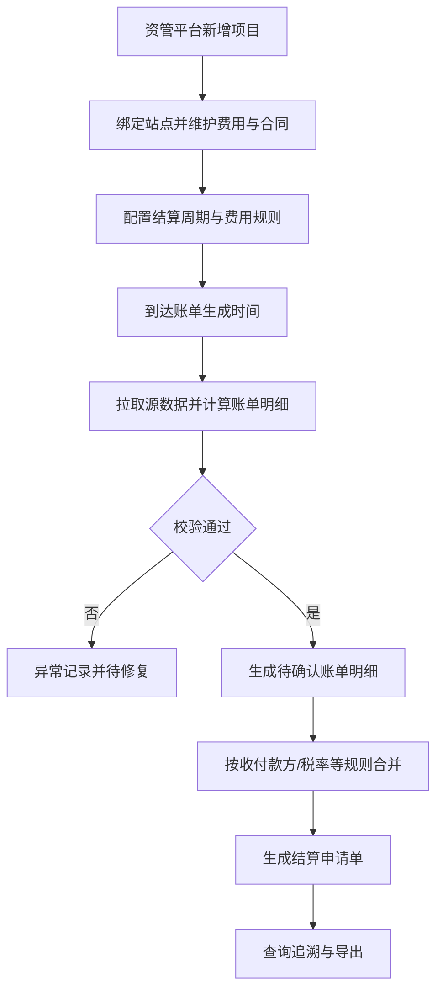

# PRD_settlement_V2.2.1_20260226_v4

## 文档基础信息表

| 项目 | 内容 |
| :--- | :--- |
| **产品版本** | V2.2.1 |
| **创建日期** | 2026-02-26 |
| **产品经理** | 洪洁 |
| **所属项目** | DAO OS 2.0 - 运营链路拉通项目 |
| **涉及平台** | 资管平台 |
| **需求类型** | 新增功能 |
| **UI设计稿** | 待补充 |

## 1. 文档概述

### 1.1. 需求背景
- **需求来源**：储能运营商与合作方结算目前依赖人工导数和手工计算，效率低且易出错，需在资管平台新增结算能力。
- **用户角色与场景**：
  - Who：结算专员、运营人员、财务复核人员。
  - When & Where：每个结算周期（如月结）在资管平台执行配置、出账、合并与复核。
  - What：在资管平台新增项目并维护项目-站点-费用-合同关系，按规则自动生成账单明细并合并生成结算申请单。
- **商业价值**：提升结算自动化与准确性，降低人工风险，沉淀可扩展到光伏、充电桩、售电、能源站的统一结算底座。

### 1.2. 目标用户
1. 资管平台结算专员。
2. 资管平台运营人员。
3. 资管平台财务复核人员。

### 1.3. 版本目标
- **目标效果**：
  1. 在资管平台实现项目新增与结算配置。
  2. 按站点自动生成四类费用账单明细。
  3. 按收款方、付款方、税率一致合并生成结算申请单。
  4. 实现费用、结算周期、规则、收付款方、分成比例、账单生成时间可配置。
- **范围边界**：
  - 做什么：项目新增、站点绑定、费用规则配置、合同维护、自动出账、账单合并、账单追溯。
  - 不做什么：审批流、开票对接、应收应付台账。

### 1.4. 名词解释

| 名词 | 解释说明 |
| :--- | :--- |
| 结算周期 | 账单计算时间范围，如自然月 |
| 账单明细 | 某站点在某账期某费用项的计算结果 |
| 结算申请单 | 按合并规则聚合后的结算单据 |
| 峰谷套利收益 | 分时段放电收益减去分时段充电成本 |
| 需量电费增额 | 需量差值乘以需量电价 |
| 逆流容差额 | 储能上网电量结合计量电价与光伏上网电价计算的差额 |

## 2. 功能需求

### 2.1. 产品流程图

### 2.2. 功能列表
| 所属平台 | 功能模块 | 主要功能描述 |
| :--- | :--- | :--- |
| 资管平台 | 项目新增与基础维护 | 新增结算项目，维护项目基础信息和状态 |
| 资管平台 | 项目关联配置 | 项目绑定站点，站点绑定费用项和合同 |
| 资管平台 | 规则配置中心 | 配置费用规则、结算周期、税率、分成比例、收付款方、账单生成时间 |
| 资管平台 | 自动出账任务 | 按结算周期自动生成账单明细 |
| 资管平台 | 结算申请单合并 | 将满足条件的账单明细自动合并为申请单 |
| 资管平台 | 账单追溯与导出 | 查看公式与来源快照并导出明细与申请单 |

### 2.3. 功能详情
- **功能名称**：项目新增与项目-站点-费用-合同关联
- **用户故事**：作为一名结算专员，我想在资管平台新增项目并绑定站点、费用和合同，以便系统按站点自动结算。
- **界面元素说明**：
  - 查询区域：支持按项目名称、项目状态、创建时间筛选。
  - 列表区域：展示项目名称、状态、站点数、费用项数、合同数、更新时间；支持查看详情与编辑。
  - 功能按钮区域：新增项目、编辑项目、停用项目；停用需二次确认。
  - 表单/详情页区域：项目名称（必填）、项目编码（系统生成只读）、生效时间（必填）、项目状态（必填）。
- **详细描述**：
  - 前置条件：用户具备结算配置权限。
  - 交互流程：新增项目 -> 绑定站点 -> 绑定费用项 -> 绑定合同 -> 保存。
  - 业务规则：同站点同费用项同生效区间不可重复；合同有效期必须覆盖账期。
  - 异常处理：配置冲突时阻断提交并提示冲突项。

- **功能名称**：规则配置中心
- **用户故事**：作为一名运营人员，我想配置费用和计算规则，以便无需开发改代码即可调整结算。
- **界面元素说明**：
  - 查询区域：按费用类型、账单周期、规则状态、生效时间筛选。
  - 列表区域：展示规则名称、费用类型、优先级、生效区间、状态；支持版本查看。
  - 功能按钮区域：新增规则、复制规则、发布规则、停用规则。
  - 表单/详情页区域：费用类型、结算周期、收款方、付款方、税率、分成比例、账单生成时间、数据来源、生效区间。
- **详细描述**：
  - 前置条件：项目与费用项已配置。
  - 交互流程：新建规则 -> 填写参数 -> 校验 -> 发布。
  - 业务规则：分成比例区间 0~100%；规则优先级为站点级 > 项目级 > 平台默认。
  - 异常处理：参数缺失、税率非法、时间重叠冲突时不可发布。

- **功能名称**：自动出账与费用计算
- **用户故事**：作为一名结算专员，我想系统按账期自动计算账单明细，以便缩短结算时间。
- **界面元素说明**：
  - 查询区域：按账期、项目、站点、任务状态筛选。
  - 列表区域：展示任务批次、账期、成功数、失败数、异常数、执行时长。
  - 功能按钮区域：立即执行、重试失败、导出结果。
  - 表单/详情页区域：展示账单明细、计算参数、来源数据、异常信息。
- **详细描述**：
  - 前置条件：规则已发布且数据可用。
  - 交互流程：任务触发 -> 拉取源数据 -> 计算账单明细 -> 校验 -> 入库。
  - 业务规则：
    - 租赁费：按设备或站点分阶段月租计算。
    - 节能分成收益 = （峰谷套利收益 - 需量电费增额）* 节能方分成比例。
    - 峰谷套利收益 = Σ(各时段放电电量*对应电价) - Σ(各时段充电电量*对应电价)。
    - 需量电费增额 = 需量差值*需量电价。
    - 逆流容差额 = 储能上网电量*(计量电价*付款方分成比例-光伏上网电价)；若无光伏上网电价则不减该项。
    - 需求响应收益 = 削峰或填谷认定金额*收款方分成比例。
  - 异常处理：缺数、负值异常、合同失效、税率冲突时标记异常并阻断该条明细。

- **功能名称**：结算申请单合并与追溯
- **用户故事**：作为一名财务复核人员，我想自动合并明细并查看计算依据，以便快速复核。
- **界面元素说明**：
  - 查询区域：按收付款方、税率、账期、申请单状态筛选。
  - 列表区域：展示申请单号、金额、税额、明细数、状态。
  - 功能按钮区域：自动合并、手动拆分、导出。
  - 表单/详情页区域：展示合并规则命中项、明细清单、公式快照和来源快照。
- **详细描述**：
  - 前置条件：账单明细状态为待确认。
  - 交互流程：系统分组合并 -> 生成申请单 -> 查看追溯 -> 导出。
  - 业务规则：仅收款方、付款方、税率、币种、期间一致时可合并。
  - 异常处理：不满足合并条件自动拆单并提示差异字段。

## 3. 非功能性需求
| 需求类型 | 要求 |
| :--- | :--- |
| 性能要求 | 支持100站点月结批次15分钟内完成；失败任务自动重试3次 |
| 安全性要求 | 金额、合同字段按角色权限控制；关键操作全量审计日志 |
| 兼容性要求 | 兼容主流Chromium内核浏览器；接口字段采用统一字典 |
| 埋点要求 | 记录项目新增、规则发布、任务执行、异常处理、导出等关键行为 |

## 4. 后续迭代方向
- 扩展光伏、充电桩、售电、能源站费用模型。
- 增加异常中心与局部重算能力。
- 增加对账看板与争议处理能力。
